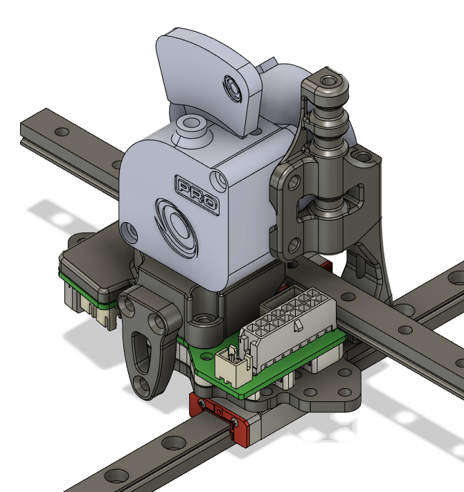

# Metal Toolhead Plates and STLs for the Annex Engineering K3
These are some parts to allow for laser cut, waterjet, or CNC plates to replace the party plate on the Annex Engineering K3.  There are DXFs included that can be used for cutting the plates.  It is recommended to use 3-3.2mm thick plates and the Y spacer height will need to be adjusted depending on the exact thickness.  CNC machined plates can also be purchased from [Northprint3D](https://northprint3d.ca/product/k3-metal-toolhead-kit/) or [Luke's Laboratory](https://lukeslabonline.com/products/k3-metal-toolhead-kit?_pos=7&_sid=71ce67e35&_ss=r).

## Compatibility
### Hotends and Part Cooling
These plates are compatible with all hotend and  part cooling configurations for the Annex Engineering K3.

### Extruders
There are currently parts to make these plates compatible with the mirrored version of the the [Bondtech LGX Lite Pro](https://www.bondtech.se/product/lgx-lite-pro-extruder/), the mirrored version of the Annex Engineering [Sherpa Micro](https://github.com/Annex-Engineering/Sherpa_Micro-Extruder), both mirrored and standard version of the Annex Engineering [Sherpa Mini](https://github.com/Annex-Engineering/Sherpa_Mini-Extruder), the Annex Engineering [Double Folded Ascender](https://github.com/Annex-Engineering/Folded_Ascender-Extruder).  All are compatible with the K3rabiner toolhead PCB with the exception of the Double Folded Ascender.  Additional versions of the extruder spacers are included that are slightly taller to allow for the use of rail backers on the crossed gantry rails if desired.

#### Bondtech LGX Lite Pro

#### Mirrored Annex Engineering Sherpa Micro

#### Annex Engineering Sherpa Mini

#### Annex Engineering Double Folded Ascender
